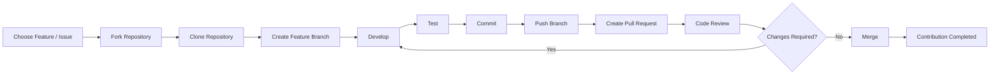
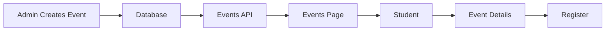
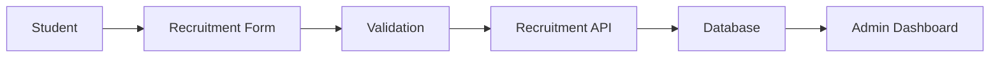
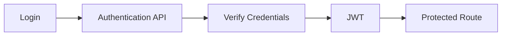
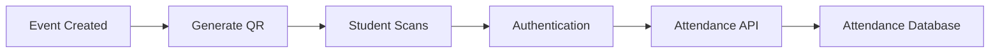
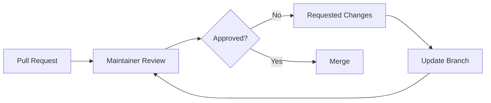

<div align="center">

# SVKM NMIMS GLOBAL UNIVERSITY

### Formerly

#### SVKM's Institute of Technology

<br>

# 🚀 CLUB APEX

### Coding & Development Club

**Learn • Build • Contribute • Innovate**

<br>

[](https://github.com/club-apex-official/Club-Apex)
[](https://react.dev/)
[](https://vite.dev/)
[](https://github.com/club-apex-official)

</div>

---

# 📖 About Club Apex

**Club Apex** is a student-driven coding and development community focused on technology, software development, open source, innovation, and collaboration.

The club provides students with opportunities to move beyond classroom learning and gain practical experience by:

* Building real-world projects
* Participating in technical workshops
* Learning modern technologies
* Collaborating with other students
* Exploring open-source development
* Developing technical and professional skills
* Contributing to community-driven initiatives

> **Our goal is simple: Learn together, build together, and grow together.**

---

# 🌟 Our Activities

Club Apex organizes technical and community-oriented activities throughout the academic year.

One of our notable activities was the **Build With AI Workshop**, which introduced students to AI-related concepts and practical applications.

### Build With AI Workshop

**Participation:** 382 students

The workshop provided students with an opportunity to explore AI, understand its practical applications, and learn how emerging technologies can be integrated into development.

> More activity photos and detailed event information will be added to the project Activity Feed.

---

# 🔥 Club Apex OpenForge 2026

## What is OpenForge?

**OpenForge 2026** is Club Apex's open-source contribution initiative.

The objective is to give students a practical introduction to open-source development by allowing them to contribute to a real project rather than only learning Git and GitHub theoretically.

Participants can:

* Explore a real-world codebase
* Select an issue or feature
* Create their own development branch
* Implement a feature or improvement
* Test their changes
* Create a Pull Request
* Receive code review
* Improve their implementation
* Get their contribution merged

### 📅 Program

**15 August – 31 August 2026**

### 💰 Participation

**Free**

### 🎯 Who can participate?

Students interested in:

* Web development
* React
* JavaScript
* UI/UX
* Backend development
* Databases
* Git & GitHub
* Open source
* Documentation
* Testing
* Project management

**Previous open-source experience is not required.**

Beginners are welcome.

---

# 🧭 OpenForge Contribution Flow



---

# 🛠️ Club Apex Website

The Club Apex website is designed as a central platform for students to:

* Discover Club Apex
* Explore events
* View the team
* Follow club activities
* Apply for recruitment
* Register for events
* Access their student workspace
* Receive certificates and badges
* Interact with club resources

The project is being developed in stages so contributors can work on individual features without needing to understand the entire system at once.

---

# 📋 Feature Overview

| Feature                      | Purpose                          | Status                     |
| ---------------------------- | -------------------------------- | -------------------------- |
| 🏠 Home                      | Club introduction and highlights | Prototype                  |
| 📅 Events                    | Browse Club Apex events          | Prototype                  |
| 📝 Event Registration        | Register for events              | Prototype / Future Backend |
| 👥 Team                      | Display club team                | Prototype                  |
| 📰 Activity Feed             | Display club activities          | Prototype                  |
| 🚀 Recruitment               | Student applications             | Prototype                  |
| 📖 About                     | Club information                 | Prototype                  |
| 📞 Contact                   | Core team contacts               | Prototype                  |
| 🔐 Authentication            | Student login/signup             | Planned Backend            |
| 🎓 Student Dashboard         | Student workspace                | Prototype                  |
| 📜 Certificates              | Certificate management           | Planned                    |
| 🏅 Skill Badges              | Student recognition              | Planned                    |
| 📱 QR Attendance             | Event attendance                 | Planned                    |
| 📢 Announcements             | Club announcements               | Planned                    |
| 💼 Student Workspace         | Student-specific workspace       | Planned                    |
| 👨‍💼 Admin Dashboard        | Club administration              | Prototype                  |
| 📅 Event Management          | Admin event management           | Planned                    |
| 👥 Student Management        | Manage students                  | Planned                    |
| 🏆 Certificate Management    | Generate/manage certificates     | Planned                    |
| 🧑‍💻 Recruitment Management | Manage applications              | Planned                    |
| 👥 Team Management           | Manage team members              | Planned                    |
| 📊 Analytics                 | Club statistics                  | Planned                    |
| 🔑 Delegated Admin           | Multiple admin roles             | Planned                    |
| 📰 Activity Management       | Manage activities                | Planned                    |

---

# 🏗️ Contributor Feature Guides

The sections below explain what each feature does and what contributors can implement.

---

<a name="home-page"></a>

# 🏠 1. Home Page

## Purpose

The Home page is the primary landing page for Club Apex.

It should immediately communicate:

* Who Club Apex is
* What the club does
* Current initiatives
* Upcoming events
* Community statistics
* Team highlights
* Recruitment opportunities

## Current Prototype

The frontend includes sections such as:

* Hero
* Features
* Statistics
* Upcoming Events
* Team Preview
* Timeline Preview
* CTA
* Sponsors

## Contributor Opportunities

Contributors can improve:

* Hero animations
* Responsive design
* Accessibility
* Event integration
* Dynamic statistics
* API-based content
* SEO
* Performance

## Future Implementation

```text
CMS / Admin
     ↓
Home API
     ↓
React Home Page
     ↓
Dynamic Content
```

---

<a name="events"></a>

# 📅 2. Events

## Purpose

The Events section allows students to discover Club Apex events.

## Current Event

### Club Apex OpenForge 2026

**Date:** 15 August – 31 August 2026

**Registration:**

https://forms.cloud.microsoft/r/gc11NiwgQV

## Current Prototype

The Events feature contains:

* Event cards
* Event listing
* Event details page
* Event information
* Registration CTA
* Event mode
* Location
* Participation information

## Contributor Opportunities

Implement:

* Event API
* Event database model
* Admin event creation
* Event editing
* Event deletion
* Registration system
* Registration limits
* Event status
* Search
* Filtering
* Sorting

## Suggested Data Model

```text
Event
├── title
├── description
├── type
├── date
├── mode
├── location
├── registrationLink
├── capacity
├── participants
└── status
```

## Expected Flow



---

<a name="team-page"></a>

# 👥 3. Team

## Purpose

The Team page displays the people responsible for Club Apex.

## Current Team

The current prototype includes:

* Bhavesh Malpure — Lead
* Vipul Mali — Technical Lead
* Yash Birari — Technical Co-lead
* Kartik Patil — Finance Lead
* Pranav Patil — Documentation Lead
* Bhumika Shimpi — Marketing Lead
* Gauravi Patil — Creativity Lead
* Bhumika Bhavre — Technical Team Member

## Contributor Opportunities

Implement:

* Dynamic team API
* Team categories
* Department filtering
* Member profiles
* Social links
* Profile images
* Admin team management

## Suggested Model

```text
TeamMember
├── name
├── role
├── department
├── image
├── bio
├── github
├── linkedin
└── status
```

---

<a name="activity-feed"></a>

# 📰 4. Activity Feed

## Purpose

The Activity Feed showcases what Club Apex has been doing.

## Current Activity

### Build With AI Workshop

**Participation:** 382 students

The activity page is designed around large event/activity cards containing:

* Event photographs
* Automatic image slideshow
* Event title
* Description
* Read More button

The slideshow should:

* Change automatically every **2 seconds**
* Continue until the final image
* Restart from the first image
* Work without user interaction
* Support manual navigation if implemented

## Contributor Opportunities

Implement:

* Activity API
* Database storage
* Image upload
* Image optimization
* Pagination
* Categories
* Activity search
* Admin activity creation
* Gallery management

## Suggested Structure

```text
Activity
├── title
├── description
├── date
├── participationCount
├── images[]
├── category
└── createdAt
```

---

<a name="recruitment"></a>

# 🚀 5. Recruitment

## Purpose

The Recruitment page allows students to apply to Club Apex.

## Current Prototype

The prototype contains a frontend-only application form.

The initial form includes:

### Personal Information

* Name
* PRN
* Email
* Phone
* Year
* Branch

### Developer Information

* About Yourself
* Technical Skills
* GitHub Profile
* Open Source Experience
* Preferred Contribution Area

### Communication

* WhatsApp Group
* Contribution-process confirmation

## Contributor Opportunities

Future contributors can implement:

* Backend form submission
* Database storage
* Form validation
* Duplicate application detection
* Application status
* Admin review
* Accept/reject workflow
* Email notifications

## Suggested Flow



---

<a name="about-page"></a>

# 📖 6. About Page

## Purpose

The About page explains:

* Club Apex
* Its purpose
* Its vision
* Its activities
* Its community
* Open-source initiatives

## Contributor Opportunities

Improve:

* Club timeline
* Mission and vision
* Achievements
* Statistics
* Interactive timeline
* Club history
* Accessibility

---

<a name="authentication"></a>

# 🔐 7. Authentication

## Purpose

Authentication allows students and administrators to securely access protected features.

## Planned Features

* Student signup
* Student login
* Logout
* Password protection
* JWT authentication
* Role-based access
* Admin authentication
* Delegated admin access

## Suggested Flow



## Contributor Opportunities

Implement:

* User model
* Password hashing
* Login API
* Signup API
* JWT
* Protected routes
* Role middleware
* Token refresh
* Logout handling

---

<a name="student-dashboard"></a>

# 🎓 8. Student Dashboard

## Purpose

The dashboard provides students with a personalized workspace.

## Planned Information

* Profile
* Registered events
* Certificates
* Badges
* Attendance
* Activity
* Workspace
* Settings

## Contributor Opportunities

Implement:

* User dashboard API
* Student statistics
* Registered-event list
* Attendance history
* Certificate list
* Badge list
* Profile editing

---

<a name="certificates"></a>

# 📜 9. Certificates

## Purpose

The certificate system allows Club Apex to generate and provide certificates for students.

## Planned Features

* Certificate generation
* Certificate templates
* Unique certificate ID
* Student certificate list
* Download
* Verification

## Contributor Opportunities

Implement:

* Certificate database model
* PDF generation
* Certificate templates
* Verification page
* Admin certificate generation
* Bulk generation

## Suggested Flow

```text
Event
 ↓
Attendance
 ↓
Eligible Students
 ↓
Certificate Generation
 ↓
Certificate ID
 ↓
Student Dashboard
```

---

<a name="skill-badges"></a>

# 🏅 10. Skill Badges

## Purpose

Skill badges recognize student achievements and technical capabilities.

Examples:

* Web Development
* AI/ML
* Open Source
* Git & GitHub
* UI/UX
* Leadership

## Contributor Opportunities

Implement:

* Badge model
* Badge assignment
* Badge criteria
* Student badge display
* Admin badge management

---

<a name="qr-attendance"></a>

# 📱 11. QR Attendance

## Purpose

QR attendance provides a quick way to record student participation in events.

## Expected Flow



## Contributor Opportunities

Implement:

* QR generation
* QR scanning
* Attendance API
* Duplicate scan prevention
* Attendance timestamps
* Admin attendance dashboard
* Attendance export

---

<a name="announcements"></a>

# 📢 12. Announcements

## Purpose

Provide students with important Club Apex updates.

Examples:

* Event announcements
* Registration openings
* Workshop announcements
* Recruitment
* Important deadlines

## Contributor Opportunities

Implement:

* Announcement API
* Admin creation
* Editing
* Deletion
* Scheduling
* Student feed
* Notifications

---

<a name="student-workspace"></a>

# 💼 13. Student Workspace

## Purpose

A personal workspace where students can access their Club Apex-related information.

## Planned Features

* Personal information
* Events
* Projects
* Certificates
* Badges
* Contributions
* Activity

## Contributor Opportunities

Build:

* Workspace dashboard
* Contribution history
* Project tracking
* Personal statistics
* Profile integration

---

<a name="admin-dashboard"></a>

# 👨‍💼 14. Admin Dashboard

## Purpose

The Admin Dashboard provides centralized management for Club Apex.

## Planned Management Areas

* Events
* Students
* Attendance
* Certificates
* Recruitment
* Team
* Timeline
* Announcements
* Analytics
* Admin access

## Contributor Opportunities

Implement:

* Admin layout
* Dashboard statistics
* Management tables
* Search/filter
* CRUD operations
* Role permissions
* Activity logs

---

<a name="admin-access"></a>

# 🔑 15. Delegated Admin Access

## Purpose

Not every administrator should have complete control.

The system should support different administrative permissions.

Example:

```text
Super Admin
├── Events
├── Students
├── Recruitment
├── Certificates
├── Team
└── Admin Access

Event Admin
└── Events

Recruitment Admin
└── Recruitment

Team Admin
└── Team
```

## Contributor Opportunities

Implement:

* Admin roles
* Permission model
* Role middleware
* Permission checks
* Admin management UI
* Audit logs

---

# 📊 16. Analytics

## Purpose

Analytics provide insights into Club Apex activities.

Possible metrics:

* Total students
* Event registrations
* Event participation
* Recruitment applications
* Attendance
* Certificates issued
* Open-source contributions

## Contributor Opportunities

Implement:

* Analytics API
* Aggregation queries
* Dashboard charts
* Date filtering
* Event comparison

---

# 🧱 Technology Stack

## Current Frontend

| Technology   | Purpose                   |
| ------------ | ------------------------- |
| React        | UI development            |
| Vite         | Development/build tooling |
| React Router | Routing                   |
| JavaScript   | Application logic         |
| CSS          | Styling                   |

## Planned Backend

| Technology | Purpose        |
| ---------- | -------------- |
| Node.js    | Runtime        |
| Express.js | REST API       |
| MongoDB    | Database       |
| JWT        | Authentication |

## Development Tools

* Git
* GitHub
* VS Code
* npm

---

# 📁 Project Structure

```text
Club-Apex/
│
├── public/
│
├── src/
│   │
│   ├── assets/
│   │   ├── images/
│   │   ├── icons/
│   │   └── illustrations/
│   │
│   ├── components/
│   │   ├── common/
│   │   ├── home/
│   │   ├── events/
│   │   ├── team/
│   │   ├── dashboard/
│   │   └── admin/
│   │
│   ├── layouts/
│   │
│   ├── mock/
│   │
│   ├── pages/
│   │
│   ├── styles/
│   │
│   └── utils/
│
├── package.json
├── vite.config.js
└── README.md
```

---

# 🚀 Running the Project Locally

## Prerequisites

Install:

* Node.js
* npm
* Git

Check your installation:

```bash
node --version
npm --version
git --version
```

## Clone the Repository

```bash
git clone https://github.com/club-apex-official/Club-Apex.git
```

Enter the project:

```bash
cd Club-Apex
```

## Install Dependencies

```bash
npm install
```

## Start Development Server

```bash
npm run dev
```

The terminal will provide the local development URL.

---

# 🌿 Git Branching Strategy

Do not directly develop features on `main`.

Create a feature branch:

```bash
git checkout -b feature/event-registration
```

Examples:

```text
feature/event-registration
feature/activity-gallery
feature/student-dashboard
feature/qr-attendance
feature/certificate-generation
fix/navbar-mobile
fix/event-routing
docs/contribution-guide
```

---

# 🤝 How to Contribute

## Step 1 — Fork the Repository

Open the Club Apex repository on GitHub and click:

**Fork**

This creates your own copy of the repository.

---

## Step 2 — Clone Your Fork

Replace `YOUR-USERNAME` with your GitHub username.

```bash
git clone https://github.com/YOUR-USERNAME/Club-Apex.git
```

Then:

```bash
cd Club-Apex
```

---

## Step 3 — Install Dependencies

```bash
npm install
```

---

## Step 4 — Create a Feature Branch

Never work directly on `main`.

```bash
git checkout -b feature/your-feature-name
```

Example:

```bash
git checkout -b feature/event-registration
```

---

## Step 5 — Develop

Implement your feature.

Follow the existing project structure and coding style.

Before submitting:

* Check the browser console
* Check the terminal
* Test responsive layouts
* Test navigation
* Check for broken links
* Check for unused imports
* Check for build errors

---

## Step 6 — Check Your Changes

```bash
git status
```

Review your changes:

```bash
git diff
```

---

## Step 7 — Commit

Use a meaningful commit message.

```bash
git add .
git commit -m "feat: add event registration"
```

### Commit examples

```text
feat: add activity gallery
feat: implement event filtering
fix: resolve mobile navbar issue
fix: correct event routing
docs: update contributor guide
style: improve event card layout
```

---

## Step 8 — Push Your Branch

```bash
git push origin feature/event-registration
```

---

# 🔀 Creating a Pull Request

After pushing your branch:

1. Open the Club Apex GitHub repository.
2. GitHub should show your recently pushed branch.
3. Click **Compare & pull request**.
4. Select the appropriate base branch.
5. Add a clear title.
6. Explain your implementation.
7. Add screenshots when your change affects the UI.
8. Submit the Pull Request.

---

# 📝 Pull Request Template

Use the following structure:

```markdown
## What does this PR do?

Briefly describe the feature/fix.

## Related Issue

Closes #ISSUE_NUMBER

## Changes Made

- Added ...
- Updated ...
- Implemented ...

## How was it tested?

- [ ] Desktop
- [ ] Mobile
- [ ] Chrome
- [ ] Build tested
- [ ] No console errors

## Screenshots

Add screenshots if the change affects the UI.

## Additional Notes

Anything reviewers should know.
```

---

# 🔍 Code Review Process

After creating a Pull Request:



A contributor may be asked to:

* Fix bugs
* Improve UI
* Refactor code
* Add validation
* Improve accessibility
* Update documentation

This is a normal part of open-source development.

---

# ⚠️ Contribution Rules

Before submitting a Pull Request:

### Do

* Keep changes focused
* Follow the existing project structure
* Write readable code
* Test your changes
* Explain your implementation
* Add screenshots for UI changes
* Keep commits meaningful
* Ask questions when requirements are unclear

### Avoid

* Direct commits to `main`
* Unrelated changes
* Large unnecessary dependencies
* Hard-coded secrets
* Breaking existing routes
* Deleting working components without reason
* Changing the design system unnecessarily
* Uploading sensitive information

---

# 🎨 Design System

Club Apex uses a consistent visual language.

### Core Colors

| Color      | Hex       |
| ---------- | --------- |
| Background | `#f3f4f4` |
| Primary    | `#853953` |
| Secondary  | `#612d53` |
| Dark       | `#2c2c2c` |

### Design Principles

* Clean
* Modern
* Professional
* Responsive
* Accessible
* Minimal
* Consistent

Contributors should reuse the existing CSS variables instead of introducing unnecessary new colors.

---

# 🗺️ Development Roadmap

## Phase 1 — Prototype

* [x] Public website structure
* [x] Home page
* [x] Events
* [x] Event details
* [x] Team
* [x] Activity Feed
* [x] Recruitment UI
* [x] About
* [x] Contact
* [x] Navigation
* [x] Responsive foundation

## Phase 2 — Backend Foundation

* [ ] Node.js backend
* [ ] Express API
* [ ] MongoDB
* [ ] Database models
* [ ] REST APIs
* [ ] Authentication

## Phase 3 — Platform Features

* [ ] Student authentication
* [ ] Student profiles
* [ ] Event registration
* [ ] QR attendance
* [ ] Certificates
* [ ] Skill badges
* [ ] Student workspace
* [ ] Activity feed management

## Phase 4 — Administration

* [ ] Admin authentication
* [ ] Role-based access
* [ ] Delegated administrators
* [ ] Event management
* [ ] Student management
* [ ] Recruitment management
* [ ] Certificate management
* [ ] Team management
* [ ] Announcement management
* [ ] Analytics

## Phase 5 — Future Expansion

* [ ] AI recommendations
* [ ] Community chat
* [ ] Payment integration
* [ ] Mobile application
* [ ] Advanced analytics
* [ ] More open-source initiatives

---

# 🧩 How to Pick an Issue

If you are new to the project:

### Beginner

Look for:

```text
good first issue
documentation
UI improvement
responsive design
bug
```

### Intermediate

Look for:

```text
feature
frontend
API
database
authentication
```

### Advanced

Look for:

```text
architecture
security
performance
backend
database design
authentication
```

If you are unsure what to work on, contact the maintainers before starting a large feature.

---

# 💡 Contribution Areas

You don't have to be a React developer to contribute.

| Area             | Examples                       |
| ---------------- | ------------------------------ |
| 🎨 UI/UX         | Components, responsive design  |
| ⚛️ Frontend      | React features                 |
| 🟢 Backend       | APIs and services              |
| 🗄️ Database     | Schema and queries             |
| 🔐 Security      | Authentication and permissions |
| 🧪 Testing       | Unit/integration testing       |
| 📱 Responsive    | Mobile experience              |
| 📖 Documentation | Guides and technical docs      |
| 🎯 Accessibility | WCAG improvements              |
| ⚡ Performance    | Optimization                   |
| 🎨 Design        | Visual improvements            |
| 📊 Analytics     | Dashboards and metrics         |

---

# 🧑‍💻 Contribution Philosophy

Open source is not only about writing code.

A contribution can be:

```text
Code
  +
Design
  +
Documentation
  +
Testing
  +
Ideas
  +
Bug Fixes
  +
Community
```

Every meaningful contribution helps improve the project.

---

# 🔒 Security

Never commit:

* Passwords
* API keys
* Tokens
* Database credentials
* `.env` files containing secrets
* Private certificates
* Personal sensitive information

Use environment variables for sensitive configuration.

Example:

```env
API_URL=
DATABASE_URL=
JWT_SECRET=
```

Never commit the actual values.

---

# 📜 License

The licensing terms for this project should be defined by the Club Apex maintainers before the repository is considered fully open for unrestricted reuse.

Until an official license is added, contributors should treat the repository as project-owned source code and follow the contribution instructions provided by Club Apex.

---

# ❤️ Club Apex Community

Club Apex is being built not only as a website, but as a platform for students to learn how real software projects are built.

OpenForge 2026 is an opportunity to experience the complete development cycle:

```text
Idea
 ↓
Issue
 ↓
Code
 ↓
Testing
 ↓
Pull Request
 ↓
Review
 ↓
Improvement
 ↓
Merge
 ↓
Real Contribution
```

---

<div align="center">

# 🚀 Learn. Build. Contribute.

### Club Apex OpenForge 2026

**SVKM NMIMS Global University**

Formerly
**SVKM's Institute of Technology**

<br>

**Built by students. Improved by contributors.**

</div>
